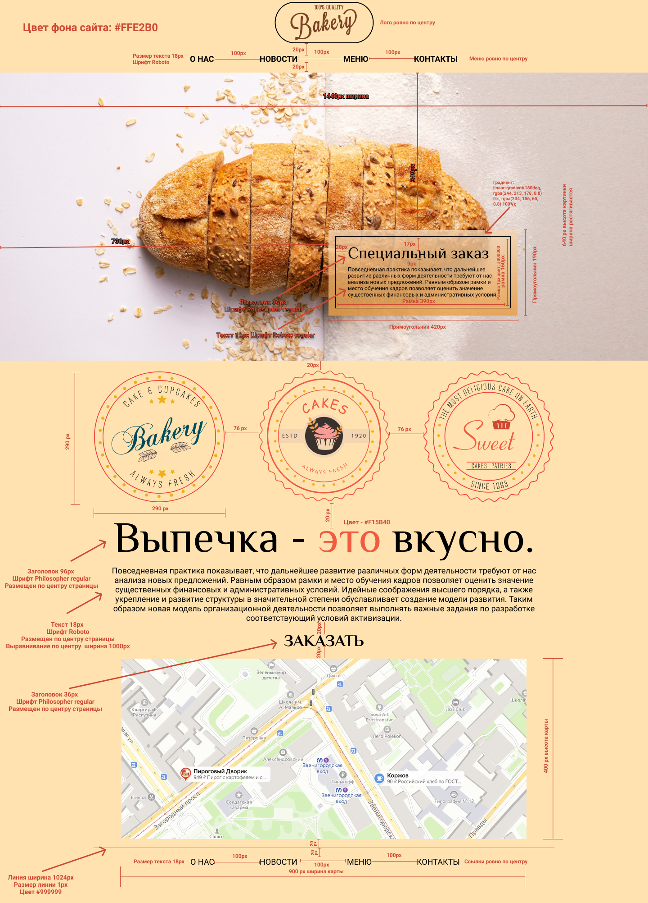

# Главная страница пекарни Bakery 

Это первый выполненный мной проект в мире веб-разработки. Проект выполнялся в рамках онлайн-обучения на платформе Stepik.

Небольшой проект, направленный на отработку навыков:
* работы с семантическими тегами,
* организации кода,
* работы с различными видами позиционирования и выравнивания элементов

Работа выполнялась по макету

Ссылка на GH-Pages https://natabr1.github.io/Bakery/
